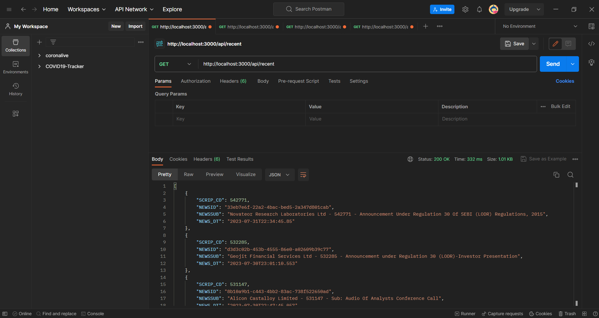
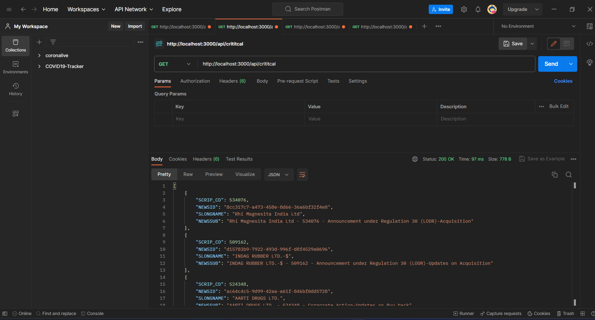
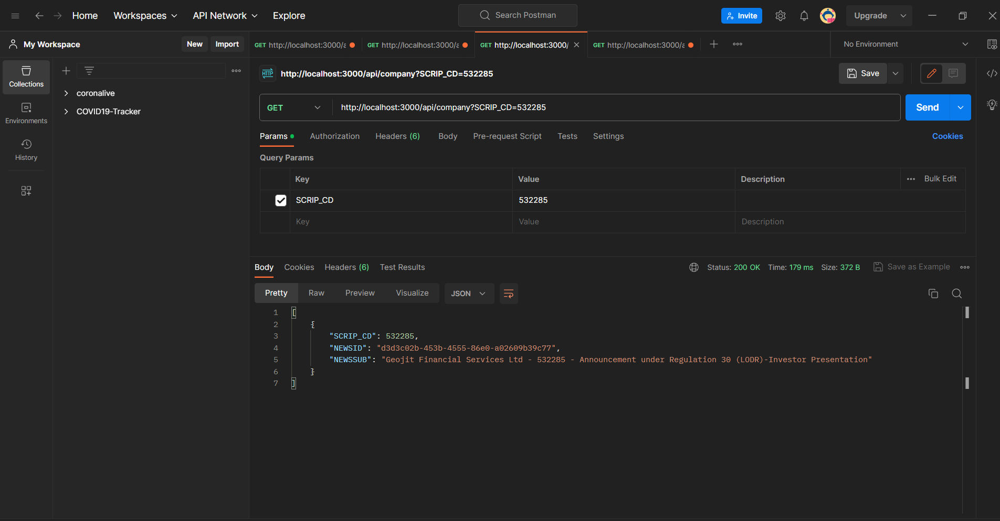
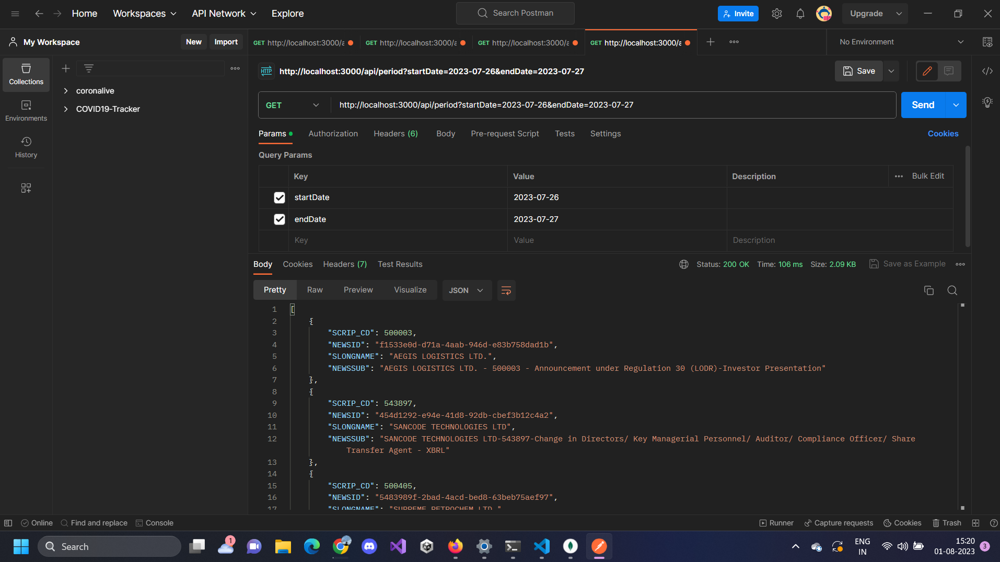

# Market Project API

## How to Start and Run the Project

To start and run the project, follow these steps:

1. Clone the repository to your local machine.
2. Install the required dependencies by running `npm install` in the project directory.
3. Start the development server by running `npm run dev`.

## APIs

The following APIs have been created:

- **GET /api/company**: Get announcements for a specific company (stock) based on the SCRIP_CD parameter. Example: [http://localhost:3000/api/company?SCRIP_CD=532285](http://localhost:3000/api/company?SCRIP_CD=532285)

- **GET /api/critical**: Get critical announcements for all companies. Example: [http://localhost:3000/api/critical](http://localhost:3000/api/critical)

- **GET /api/period**: Get announcements within a specified date range using the startDate and endDate parameters. Example: [http://localhost:3000/api/period?startDate=2023-07-26&endDate=2023-07-27](http://localhost:3000/api/period?startDate=2023-07-26&endDate=2023-07-27)

- **GET /api/recent**: Get announcements from the past 1-2 days in descending time order. Example: [http://localhost:3000/api/recent](http://localhost:3000/api/recent)

## Postman Screenshots

Here are the Postman screenshots for the APIs:

**GET /api/company**

**GET /api/critical**

**GET /api/period**

**GET /api/recent**

## Vercel Hosted Link

The project is deployed on Vercel. You can access the API using the following link:
[https://market-next-c6ha-zamg1o5a2-coderlakshya.vercel.app/](https://market-next-c6ha-zamg1o5a2-coderlakshya.vercel.app/)
